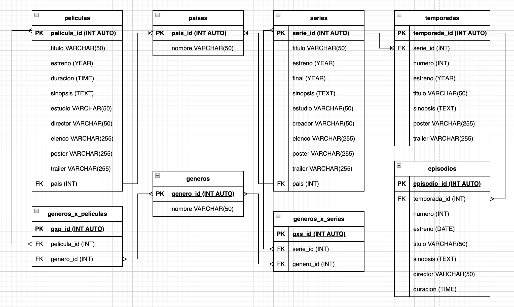

# PeliSeries

## Listado de Entidades

### peliculas **ED**

- pelicula_id **(PK)**
- titulo
- estreno
- duracion
- sinopsis
- estudio
- director
- elenco
- poster
- trailer
- pais **(FK)**

### series **(ED)**

- serie_id **(PK)**
- titulo
- estreno
- final
- sinopsis
- estudio
- creador
- elenco
- poster
- trailer 
- pais **(FK)**

### temporadas **(ED)**

- temporada_id **(PK)**
- serie_id **(FK)**
- numero
- estreno
- titulo
- sinopsis
- poster
- trailer

### episodios **(ED)**

- episodio_id **(PK)**
- temporada_id **(FK)**
- numero
- estreno
- titulo 
- sinopsis
- director
- duracion

### paises **(EC)**

pais_id
nombre

### generos **(EC)**

- genero_id *+(PK)**
- nombre

### generos_x_peliculas **(EP)**

- gxp_id **(PK)**
- pelicula_id **(FK)**
- genero_id **(FK)**

### generos_x_series **(EP)**

- gxs_id **(PX)**
- serie_id **(FK)**
- genero_id **(FK)**

## Relaciones 

- Una **pelicula** tiene **pais** (1 - M)
- Una **serie** tiene **pais** (1 - M)
- Una **temporada** pertenece a **serie** (1 - M)
- Un **episodio** pertenece a **temporada** (1 - M)
- **Peliculas** pertenecen a **generos** (M - M)
- **Series** pertenecen a **generos** (M - M)

## Diagrama

### Modelo Relacional de la BD

## Reglas de Negocio

### peliculas

1. Crear una pelicula
1. Leer todas las peliculas 
1. Leer una pelicula en particular
1. Actualizar una pelicula
1. Eliminar una pelicula

### Series

1. Crear una serie 
1. Leer todas las series
1. Leer una serie en particular
1. Leer las temporadas de una serie 
1. Leer los episodios de una serie
1. Actualizar una serie 
1. Eliminar una serie

### Temporadas

1. Crear una temporada
1. Leer todas las temporadas 
1. Leer una temporada en particular
1. Leer los episodios de una temporada
1. Actualizar una temporada
1. Eliminar una temporada

### Episodios

1. Crear un episodio
1. Leer todos los episodios 
1. Leer un episodio en particular 
1. Actualizar un episodio
1. Eliminar un episodio

### Paises

1. Crear un pais
1. Leer todos los paises
1. Leer un pais en particular 
1. Actualizar un pais 
1. Eliminar un pais

### Generos

1. Crear un genero 
1. Leer todos los generos
1. Leer un genero en particular 
1. Actualizar un genero
1. Eliminar un genero

### Generos_x_peliculas

1. Crear un gxp
1. Leer los generos de una pelicula 
1. Eliminar un gxp

### Generos_x_series

1. Crear un gxs
1. Leer los generos de una serie 
1. Eliminar un gxs
