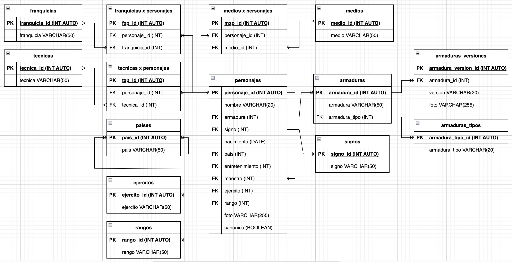

# SaintSeiya

## Listado de Entidades 

### personajes **(ED)**

- personaje_id **(PK)**
- nombre 
- armadura **(FK)**
- signo **(FK)**
- nacimiento
- pais **(FK)**
- entrenamiento **(FK)**
- maestro **(FK)**
- ejercito **(FK)**
- rango **(FK)**
- foto 
- canonico 

### armaduras **(ED | EC)**

- armadura_id **(PK)**
- armadura
- armadura_tipo **(FK)**

### armaduras_tipos **(EC)**

- armadura_tipo_id
- armadura_tipo 

### armaduras_versiones **(EC | EP)**

- armadura_version_id **(PK)**
- armadura_id **(FK)**
- version
- foto

### signos **(EC)**

- signo_id **(Pk)**
- signo

### paises **(EC)**

- pais_id **(PK)**
- pais

### ejercitos **(EC)**

- ejercito_id **(PK)**
- ejercito

### rangos **(EC)**

- rango_id **(PK)**
- rango 

### tecnicas **(EC)**

- tecnica_id **(PK)**
- tecnica 

### tecnicas_x_personajes **(EP)**

- txp_id **(PK)**
- personaje_id **(FK)**
- tecnica_id **(FK)**

### franquicias **(EC)**

- franquicia_id **(PK)**
- franquicia

### franquicias_x_personajes **(EP)**

- fxp_id **(PK)**
- personaje_id **(FK)**
- franquicia_id **(FK)**

### medios **(EC)**

- medio_id **(PK)**
- medio

### medios_x_personajes **(EP)**

- mxp_id **(PK)**
- personaje_id **(FK)**
- medio_id **(FK)**

## Relaciones

1. Un **personaje** poseé **armadura** (1 - M )
1. Una **armadura** pertenece a un **tipo de armadura** (1 - M)
1. Una **armadura** tiene **versiones** (1 - M)
1. Un **personaje** pertenece a un **signo** (1 - M)
1. Un **personaje** pertenece a un **pais** (1 - M)
1. Un **personaje** entreno en un **pais** (1 - M)
1. Un **personaje** tiene un **maestro** (1 - M)
1. Un **personaje** pertenece a un **ejercito** (1 - M)
1. Un **personaje** tiene un **rango** (1 - M)
1. **Personajes** poseen **tecnicas** (M - M)
1. **Personajes** pertenecen a **franquicias** (M - M)
1. **Personajes** pertenecen a **medios** (M - M)

### Modelo Relacional de la BD

## Reglas de negocio

### personajes

1. Crear un personaje
1. Leer todos los personajes
1. Leer un personaje en particular 
1. Actualizar un personaje 
1. Eliminar un personaje

### armaduras

1. Crear una armadura
1. Leer todas las armaduras
1. Leer una armadura en particular
1. Actualizar una armadura 
1. Eliminar una armadura

### armaduras_tipos

1. Crear una armadura_tipo
1. Leer todas las armaduras_tipos
1. Leer una armadura_tipo en particular
1. Actualizar una armadura_tipo
1. Eliminar una armadura_tipo

### armaduras_versiones

1. Crear una armadura_version
1. Leer todas las armaduras_versiones
1. Leer una armadura_version en particular
1. Actualizar una armadura_version
1. Eliminar una armadura_version

### signos

1. Crear un signo
1. Leer todos los signos
1. Leer un signo en particular
1. Actualizar un signo
1. Eliminar un signo

### paises

1. Crear un pais
1. Leer todos los paises
1. Leer un pais en particular
1. Actualizar un pais
1. Eliminar un pais

### ejercitos

1. Crear un ejercito
1. Leer todos los ejercitos 
1. Leer un ejercito en particular
1. Actualizar un ejercito
1. Eliminar un ejercito

### rangos

1. Crear un rango
1. Leer todos los rangos
1. Leer un rango en particular
1. Actualizar un rango
1. Eliminar un rango

### tecnicas

1. Crear un tecnica
1. Leer todas las tecnicas
1. Leer una tecnica en particular
1. Actualizar una tecnica 
1. Eliminar una tecnica

### tecnicas_x_personajes 

1. Crear una txp
1. Leer las tecnicas de un personaje
1. Eliminar un txp

### franquicias

1. Crear una franquicia 
1. Leer todas las franquicias 
1. Leer una franquicia en particular 
1. Actualizar una franquicia 
1. Eliminar una franquicia

### franquicias_x_personajes

1. Crear un fxp
1. Leer las franquicias de un personaje 
1. Eliminar un fxp

### medios

1. Crear un medio 
1. Leer todos los medios 
1. Leer un medio en particular 
1. Actualizar un medio 
1. Eliminar un medio

### medios_x_personajes

1. Crear un mxp
1. Leer los medios de un personaje 
1. Eliminar un mxp

<!-- maestro: llave foranea de la misma entidad personajes -->