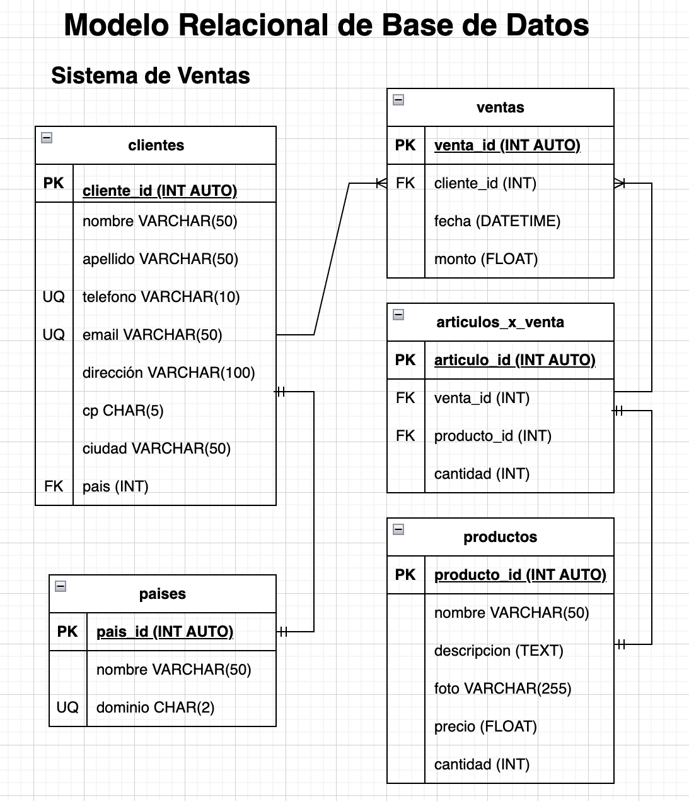

# Ventas

## Listado de Entidades

### clientes **(ED)**

* cliente_id **(PK)**
* nombre
* apellido
* telefono **(UQ)**
* email **(UQ)**
* dirección
* cp
* ciudad
* pais **(FK)**

### productos **(ED | EC)**

* producto_id **(PK)**
* nombre
* descripción 
* foto
* precio
* cantidad

### ventas

* venta_id **(PK)**
* cliente_id **(FK)**
* fecha
* monto

### articulos_x_venta **(EP)**

* articulo_id **(PK)**
* venta_id **(FK)**
* producto_id **(FK)**
* cantidad

### paises **(EC)**
* pais_id **(PK)**
* nombre
* dominio **(UQ)**

<!-- Nombre de entidades se escriben en plurales  -->

## Relaciones

<!-- donde alla llaves foraneas es donde debe haber una relación  -->

* Un **cliente** tiene **pais** (1 - 1)
* Un **cliente** genera **venta** (1 - m)
* Una **venta** tiene **articulo** (1 - m)
* Un **articulo** es un **producto** (1 - 1)

## Diagramas 

### Modelo Relacional de la BD

## Reglas de Negocio

### clientes 

1. Crear un cliente.
1. Leer todos los clientes.
1. Leer un cliente en particular.
1. Actualizar un cliente. 
1. Eliminar un cliente.

### productos 

1. Crear un producto.
1. Leer todos los productos.
1. Leer un producto en particular.
1. Actualizar un producto.
1. Eliminar un producto.
1. Cada que haya una venta restar a la cantidad de productos disponibles, el número de artículos que se vendieron.

### ventas 

1. Crear una venta.
1. Leer todas las ventas.
1. Leer una venta en particular.
1. Leer todas las ventas de un cliente.
1. Leer todas las ventas de un producto.
1. Actualizar una venta.
1. Eliminar una venta.

### articulo_x_venta

1. Crear un articulo.
1. Leer todos los articulos.
1. Leer un articulos en particular.
1. Leer todos los articulos de una venta.
1. Leer todos los articulos de un producto.
1. Leer todos los articulos de un cliente.
1. Actualizar un articulo.
1. Eliminar un artículo.

### paises 

1. Crear un pais.
1. Leer todos los paises. 
1. Leer un pais en particular. 
1. Actualizar un pais.
1. Eliminar un pais.